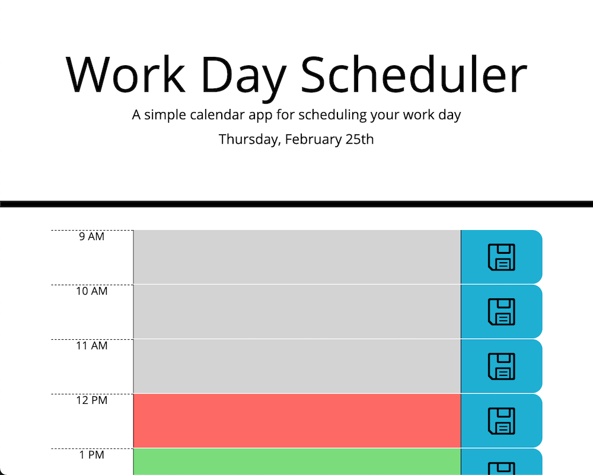

# Work_Day_Scheduler

## Description
    A simple in-browser calendar application, that allows user to enter hourly events, using Moment.js library  
    as well as dynamic HTML and CSS by use of jQuery.

## Site Screenshot
   
   

## Site Link
   Link to [Work Day Scheduler](https://takolad.github.io/hw5-Work_Day_Scheduler/).